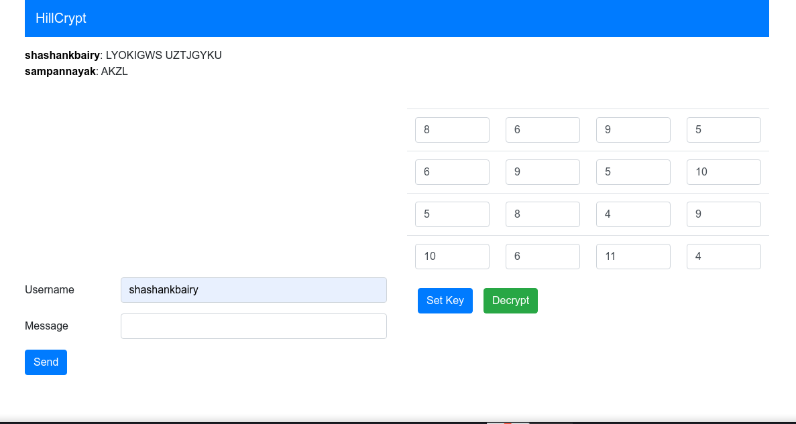

# Encrypted Message Board using 4x4 Hill Cipher

Encrypted Message Board implemented using Hill Cipher Encryption algorithm which uses 4x4 key matrix.

## Constraints

- Does not support numbers, special characters.
- Key matrix should be invertible modulo 26.

## Tech Stack used

- python
- flask
- flask-socketio
- jquery
- bootstrap

## Usage

```
1. pip3 install flask flask-socketio
2. python3 main.py
```

## Key Matrix

An example for 4x4 key matrix is:

```
8  6 9  5
6  9 5  10
5  8 4  9
10 6 11 4
```

<b>Required condition</b>: Key matrix should be invertible modulo 26.

## Screenshots

- Encrypted messages

  

- Decrypted messages

  
